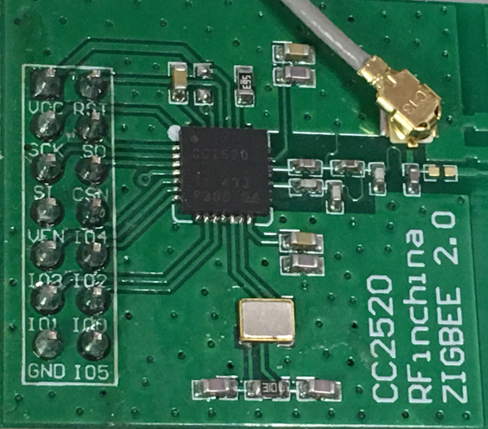

.. _cc2520:

CC2520 - 2.4 GHz ZigBee/IEEE 802.15.4 RF transceiver
####################################################

| Category: wireless-networking
| Standard: IEEE 802.15.4
| Boards: MinnowBoard MAX

Use the reference information below to set up the hardware connections between your board and the CC2520 module.

|

.. table:: Pin table of CC2520 board:

    =====  ==========================
    PIN    Name
    =====  ==========================
    1    	VCC
    2    	RST
    3    	SCLK
    4    	SO
    5    	SI
    6    	CSN
    7    	VEN
    8    	IO4
    9    	IO3
    10    	IO2
    11    	IO1
    12    	IO0
    13    	GND
    14    	IO5
    =====  ==========================

|

.. table:: Connect CC2520 board to MinnowBoard MAX low speed expansion connector (LSE):

    =====  ==========================
    LSE    CC2520
    =====  ==========================
    pin2    GND
    pin4    VCC(3V3)
    pin5    CSN
    pin7    SO
    pin9    SI
    pin11   SCK
    pin21   fifo(IO1)
    pin22   sfd(IO4)
    pin23   fifop(IO2)
    pin24   RST
    pin25   cca(IO3)
    pin26   vreg(VEN)
    =====  ==========================

|

Setup Notes
===========

* See http://wiki.minnowboard.org/MinnowBoard_MAX#LSE_Layout for additional information about MinnowBoard MAX LSE layout.

* Check the MinnowBoard MAX BIOS settings for **LPSS & SCC Configuration**:  LPSS SPI Support 
  should be enabled and LPSS PWM #1/#2 Support should be disabled.

* Boot into the system and perform these steps to enable kernel module auto loading::

     ln -s /lib/modprobe.d/spi-minnow-cc2520.conf.sample /etc/modprobe.d/spi-minnow-cc2520.conf
     ln -s /usr/lib/modules-load.d/cc2520.conf.sample /etc/modules-load.d/cc2520.conf

  Reboot the board, the related device driver and kernel modules will be auto loaded.

* Use these commands to enable and start the ostro-6lowpan service::

     systemctl enable ostro-6lowpan
     systemctl start ostro-6lowpan

  Note: For user-defined config settings, you can use these commands::

     echo "HWADDR=a0:0:0:0:0:0:0:1" > /etc/ostro-6lowpan.conf
     echo "PAN=777" >> /etc/ostro-6lowpan.conf
     echo "ADDR=8001" >> /etc/ostro-6lowpan.conf
     echo " CHANNEL=11" >> /etc/ostro-6lowpan.conf

* Run the command: ``ping6 -I lowpan0 ff02::1`` on device1 or device2, to test the connection.
